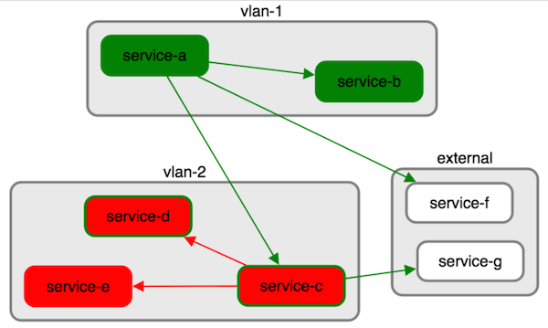

Experimental app for visualising the status of highly connected services, e.g., microservices.

It is written in [TypeScript](http://www.typescriptlang.org/) and relies heavily on the awesome [Cytoscape.js](http://js.cytoscape.org/).

Highly interconnected services can cause a cascade of failure that is hard to diagnose, i.e., a failure in one service causes failures
in its dependencies, which causes failure in their dependencies etc. This tool is an attempt to visualise the status of a network of services
so that the root cause can be quickly spotted and dealt with.

It relies on services both checking whether their dependencies are available, and exposing this data as a JSON payload.

# Running

```
npm install
grunt
```

This will open an example in the browser, served from a local web server which also hosts all the service data. In the real world,
the app will run into problems due to the [same-origin security policy](http://en.wikipedia.org/wiki/Same-origin_policy). See
[this page](https://blog.nraboy.com/2014/08/bypass-cors-errors-testing-apis-locally/) for ways around this.

# How it works

The application starts off by reading a manifest file that outlines the core services you wish to monitor. For each of these,
you can specify
 - name
 - url
 - network, which allows you to group the services, e.g., by front-end and back-end networks. If the network is not defined, it defaults
   to 'external'.

The application will then periodically check each of these URLs, and render them as:
 - all red; failed to connect to the host or parse the HTTP response
 - red with a green border; received a HTTP response, but was non-2xx
 - all green; received a 2xx response

The app is only really useful if additional information about dependent service statuses is included in the response. For example,
if service 'a' returns:

```
{
  "a1": {
    "status": "Ok"
  },
  "b": {
    "status": "Ok"
  },
  "c": {
    "status": "Ok"
  }
}
```

this indicates that it depends on service 'a1', 'b' and 'c', and so edges will be drawn on the graph to reflect the returned
status, in this case, all green for 'Ok'. Note that these services do not need to be declared in the manifest; discovered services will
be dynamically added to the visualisation (currently always in the 'external' network).

Here is an example screenshot:



# Status

Massively experimental work in progress.

# Development Notes

I am not a Typescript or even a JavaScript programmer, so expect there to be many deficiencies in the code and use of tooling!

It wasn't clear how to usefully unit test interactions with web services or a rendering library, and so there are just a small
collection of end-to-end tests using the demo data, and checking high level properties of the rendered graph such as number of nodes
and their colours.

To run the tests:

```
grunt test
```

To update build dependencies (but not yet libraries):

```
$ npm install -g npm-check-updates
$ npm-check-updates -u
$ npm install 
```

# Known Issues
 - the example was built up from testing rather than being useful as an example
 - most real services have multiple instances for resiliency. I've spiked out visualisation of this using another layer
   of nesting, but still need to bring into this codebase.
 - early experiments used [D3](http://d3js.org/) which has a model that easily supports dynamic graphs (but didn't have strong
   support for compound graphs). Whilst Cytoscape theoretically allows the graph to be modified, I haven't yet found an
   efficient way of only rendering the necessary parts of it.

# Ideas
 - add more info to nodes, maybe using [QTips](https://github.com/cytoscape/cytoscape.js-qtip)
 - use audio to indicate status, e.g., low hum for ok services, higher pitch tone when things go wrong